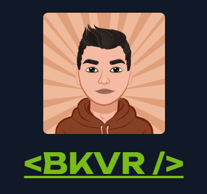

<p align="center">

</p>

# **Meet Caio Bukvar, software developer!**

This is a website is being created as a portfolio to show a bit about myself. It is a project that will be under development for a time, with constant updates.

## Technologies Used


###  Other libs:
    Sonner (for toasts)

## Navigation

> You can use the navbar to navigate the portfolio
<div align='center' display='flex'>

  
</div><br><br>

> The about section tells a little about me, my skills and my development carrer, also a few curiosities!
<div align='center' display='flex'>

  
</div><br><br>

> The experience section tells a little about my professional experience, where you can find more detailed information about each job
<div align='center' display='flex'>

  
</div><br><br>

> The projects area has clickable cards, where in each project you can see details about it and find links for each deploy and github repository
<div align='center'>

  
  
</div><br><br>

> Inside the social section, you can find links for my linkedin and github profiles and also send me an e-mail if you want to!
<div align='center'>

  
</div><br><br>


## Getting Started

Follow these instructions to set up and run the project on your local machine.

### Installation

1. **Clone the repository:**

```bash
git clone https://github.com/your-username/bkvr-dev.git
```

2. **Navigate to the project directory:**

```bash
cd bkvr-dev
```

3. **Install dependencies:**

```bash
npm install
```

